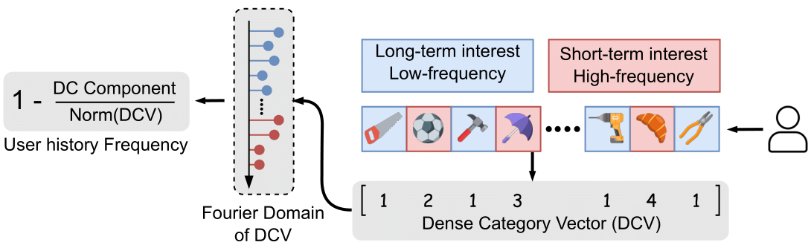

# A Systematic Reproducibility Study of BSARec for Sequential Recommendation
This is the official source code for our Reproducibility paper of ["An Attentive Inductive Bias for Sequential Recommendation beyond the Self-Attention"](https://arxiv.org/abs/2312.10325).
This will be published as part of the proceedings of the ECIR2026 Reproducibility track. We provide the codebase for the reproduction and extension of BSARec. Specifically we provide code for the extension of SR models with Padding, the evaluation of high and low frequency models.


The codebase is largely based on the [official repository](https://github.com/yehjin-shin/BSARec) for BSARec provided by Shin et al. (2024).

## File Structure

- `experiments` Contains files to run experiments and generate hyperparameters
- `fig` Contains figures included in the paper (those not generated from experiments)
- `src/` Main folder for data and models, training loop found in base of this directory.
    - `data`    contains data files and preprocessing
    - `model` contains model files for all models used
    - `visualize` contains code for visualizations

## Dataset
In the experiments, we utilize seven datasets, all stored in the `src/data` folder. 
- For the Beauty, Sports, Toys, and Yelp datasets, we employed the datasets downloaded from [this repository](https://github.com/Woeee/FMLP-Rec). 
- For ML-1M and LastFM, we processed the data according to the procedure outlined in [this code](https://github.com/RUCAIBox/CIKM2020-S3Rec/blob/master/data/data_process.py).
- For MIND, new code was created.
- The `src/data/*_same_target.npy` files are utilized for training DuoRec and FEARec, both of which incorporate contrastive learning.

## Quick Start
### Environment Setting
```
conda env create -f bsarec_env.yaml
conda activate bsarec
```

### How to train Models
- Note that the pretrained model (.pt) and the train log file (.log) will be saved in `src/output`
- `train_name`: name for the log file and the checkpoint file
```
python main.py  --data_name [DATASET] \
                --lr [LEARNING_RATE] \
                --alpha [ALPHA] \ 
                --c [C] \
                --num_attention_heads [N_HEADS] \
                --train_name [LOG_NAME] \
                --model_type BSARec
```
- Example for Beauty
```
python main.py  --data_name Beauty \
                --lr 0.0005 \
                --alpha 0.7 \
                --c 5 \
                --num_attention_heads 1 \
                --train_name BSARec_Beauty \
                --model_type BSARec
```
In order to reproduce experiments, users should vary the `data_name` and `train_name` parameters in the appropriate configurations. Additionally, this code also works for padding types, sequence lengths and all other parameters considered in our paper. In order to simplify this process we also provide code for generating hyperparameter tuning and multi-seed experiments. This constructs the input arguments and includes jobfiles that are able to run all projects on a slurm scheduler. This can be found in: `experiments/jobfiles/generate_hparams.py`, and will provide a hparams.txt file to be used in a batch job for a slurm scheduler as seen in `experiments/jobfiles/array_reproduction.job`, or a bash file.

The available datasets are:
- `ML-1M`
- `MIND`
- `Beauty`
- `Sports_and_Outdoors`
- `Yelp`
- `LastFM`
- `Toys_and_Games` 

The available models are:
- `BSARec`
- `BERT4Rec`
- `Caser`
- `SASRec`
- `GRU4Rec`
- `duoRec`
- `FeaRec`
- `SASRec`
- `FMLPRec`
- `BSARec_Skip`
- `BSARec_Wavelet`

Optionally, users can use the following additional relevant flags for the experiments regarding sequence lengths and padding. 
- `max_seq_length`, Determines the input sequence lenght used for the model.
- `padding`, Used to define a specific padding type, choose one out of `zero, cyclic, reflect and mirror`
- `seed`, Used to set the seed used for experiments. 

For all runs we have provided weights and biases integration, which requires users to log in in order to log runs. 


### How to test pretrained Model
- Note that pretrained model (.pt file) must be in `src/output`
- `load_model`: pretrained model name without .pt
```
python main.py  --data_name [DATASET] \
                --alpha [ALPHA] \ 
                --c [C] \
                --num_attention_heads [N_HEADS] \
                --load_model [PRETRAINED_MODEL_NAME] \
                --do_eval
```
- Example for Beauty
```
python main.py  --data_name Beauty \
                --alpha 0.7 \
                --c 5 \
                --num_attention_heads 1 \
                --load_model BSARec_Beauty_best \
                --do_eval
```

Again, this can be done for all combinations of datasets and models. 

### Available Models

We introduce several variants of BSARec, these can be found in the following files

- `src/model/bsarec_skip.py`

    Implementation of BSARec with skip-connection
- `src/model/bsarec_wavelet.py`

    Implementation of BSARec where the Fourier transform is replaced with the Wavelet transform

Our code to introduce padding to models is universal, and can be found in `src/dataset.py`. 


# RQ 1
Below code is given to generate a `.txt` file with the needed hyperparameters to replicate the main results table.
```
python experiments/jobfiles/generate_hparams.py

PARAMS_FILE="hparams_reproduction.txt"

# Loop through each line and run main.py with it
while IFS= read -r line; do
    python src/main.py $line
done < "$PARAMS_FILE"
```

# RQ 2
After having run all the models and datasets in RQ1, a set of json files have been outputted, needed to run the visualizations of RQ2. The code to generate the visualizations can be found in `src/visualize/distribution_classes.ipynb`. This notebook will generate Fig 4,5, and 6.

# RQ 3
Similar to RQ2, these results can be generated after having run all models and datasets in RQ1. The code to generate the visualizations can be found in `src/visualize/length_res.ipynb`. This notebook will generate Fig 7, 8, and 9.

# RQ 4
To run the experiments for RQ4, users can use the following code in `~/showcase.ipynb` to generate Fig 9. This notebook shows how to run the experiments with different padding. Do checkout `src/dataset.py`, at the `apply_padding` function, to see how padding is applied.
All runs to generate the results needed for these visualizations can be run with the following code:
```

# the padding results of Fig 8, Table 4, and Fig 9.
python experiments/jobfiles/generate_hparams_padding_experiment.py

PARAMS_FILE="hparams_padding_experiment.txt"

while IFS= read -r line; do
    python src/main.py $line
done < "$PARAMS_FILE"

# the skip connection vs wavelet results of Fig 7.
python experiments/jobfiles/generate_hparams_wavelet_experiment.py

PARAMS_FILE="hparams_wavelet_experiment.txt"

while IFS= read -r line; do
    python src/main.py $line
done < "$PARAMS_FILE"
```


### Visualizations
After running all models, the code to reproduce visualizations can be found in `src/visualize/`. They are runnable as jupyter notebook, and require running models first, note that relative paths may need to be changed for code to fuction if users do not use a scratch disk to store results. The visualizations per research question can be found in the following files:
- **RQ1** `main_table.ipynb` contains the code for the main table, and other tables generated
- **RQ2** `distribution_classes.ipynb`
- **RQ3** `length_res.ipynb`
- **RQ4** `~/showcase.ipynb` has a test setup where a user can run training and reproduce the analysis from RQ4.

## References
```bibtex
@misc{hutter2025systematicreproducibilitystudybsarec,
      title={A Systematic Reproducibility Study of BSARec for Sequential Recommendation}, 
      author={Jan Hutter and Hua Chang Bakker and Stan Fris and Madelon Bernardy and Yuanna Liu},
      year={2025},
      eprint={2512.17442},
      archivePrefix={arXiv},
      primaryClass={cs.IR},
      url={https://arxiv.org/abs/2512.17442}, 
}
```
```bibtex
@inproceedings{DBLP:conf/aaai/Shin0WP24,
  author       = {Yehjin Shin and
                  Jeongwhan Choi and
                  Hyowon Wi and
                  Noseong Park},
  editor       = {Michael J. Wooldridge and
                  Jennifer G. Dy and
                  Sriraam Natarajan},
  title        = {An Attentive Inductive Bias for Sequential Recommendation beyond the
                  Self-Attention},
  booktitle    = {Thirty-Eighth {AAAI} Conference on Artificial Intelligence, {AAAI}
                  2024, Thirty-Sixth Conference on Innovative Applications of Artificial
                  Intelligence, {IAAI} 2024, Fourteenth Symposium on Educational Advances
                  in Artificial Intelligence, {EAAI} 2014, February 20-27, 2024, Vancouver,
                  Canada},
  pages        = {8984--8992},
  publisher    = {{AAAI} Press},
  year         = {2024},
  doi          = {10.1609/AAAI.V38I8.28747}
}
```
